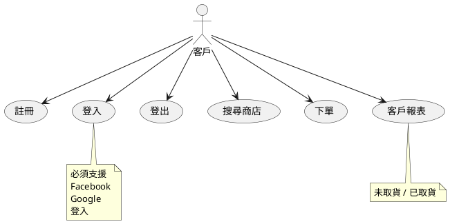
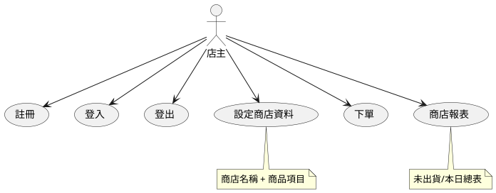

# iPos 使用者個案

## 使用個案 -- 客戶

```puml
@startuml
客戶 --> (註冊)
客戶 --> (登入)
note bottom of 登入 : 必須支援\nFacebook\nGoogle\n登入
客戶 --> (登出)
客戶 --> (搜尋商店)
客戶 --> (下單)
客戶 --> (客戶報表)
note bottom of (客戶報表) : 未取貨 / 已取貨
@enduml
```

## 使用個案 - 店主

```puml
@startuml
店主 --> (註冊)
店主 --> (登入)
店主 --> (登出)
店主 --> (設定商店資料)
note bottom of (設定商店資料) : 商店名稱 + 商品項目
店主 --> (下單)
店主 --> (商店報表)
note bottom of (商店報表) : 未出貨/本日總表
@enduml
```

