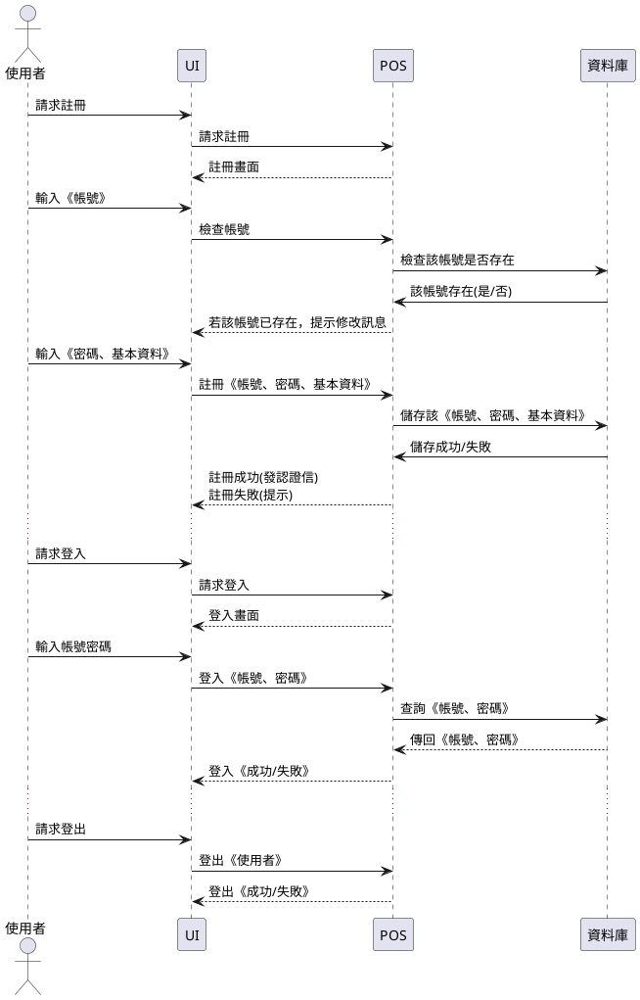
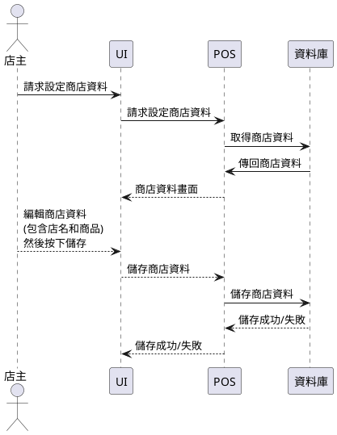
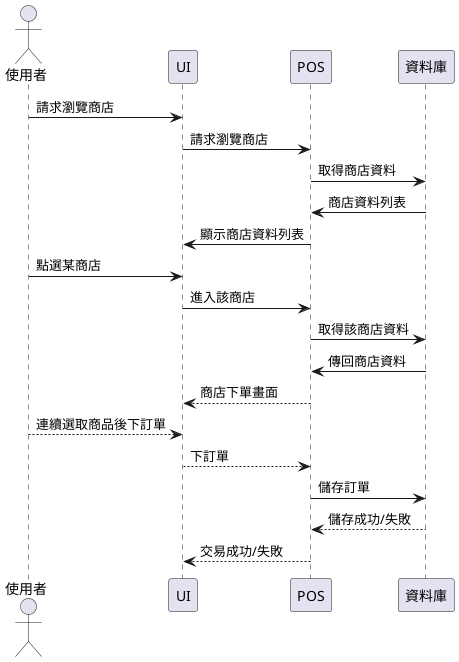
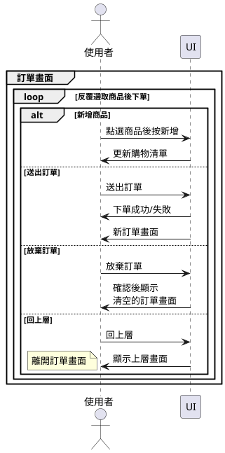
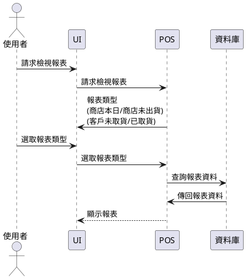

# iPos 循序圖

## 註冊/登入/登出 

使用者: 店主 + 客戶

```puml
@startuml
actor 使用者
使用者 -> UI: 請求註冊
UI -> POS: 請求註冊
POS --> UI: 註冊畫面
使用者 -> UI: 輸入《帳號》
UI -> POS: 檢查帳號
POS -> 資料庫: 檢查該帳號是否存在
資料庫 -> POS: 該帳號存在(是/否)
POS --> UI: 若該帳號已存在，提示修改訊息
使用者 -> UI: 輸入《密碼、基本資料》
UI -> POS: 註冊《帳號、密碼、基本資料》
POS -> 資料庫: 儲存該《帳號、密碼、基本資料》
資料庫 -> POS: 儲存成功/失敗
POS --> UI: 註冊成功(發認證信)\n註冊失敗(提示)
...
使用者 -> UI: 請求登入
UI -> POS: 請求登入
POS --> UI: 登入畫面
使用者 -> UI: 輸入帳號密碼
UI -> POS: 登入《帳號、密碼》
POS -> 資料庫: 查詢《帳號、密碼》
資料庫 --> POS : 傳回《帳號、密碼》
POS --> UI: 登入《成功/失敗》
...
使用者 -> UI: 請求登出
UI -> POS: 登出《使用者》
POS --> UI: 登出《成功/失敗》
@enduml
```

## 設定商店資料

使用者 : 店主

```puml
@startuml
actor 店主
店主 -> UI: 請求設定商店資料
UI -> POS: 請求設定商店資料
POS -> 資料庫: 取得商店資料
資料庫 -> POS : 傳回商店資料
POS --> UI: 商店資料畫面
店主 --> UI: 編輯商店資料\n(包含店名和商品)\n然後按下儲存
UI --> POS: 儲存商店資料
POS -> 資料庫: 儲存商店資料
資料庫 --> POS : 儲存成功/失敗
POS -->  UI: 儲存成功/失敗
@enduml
```

## 搜尋商店/下單

使用者 : 店主 + 客戶

```puml
@startuml
actor 使用者
使用者 -> UI: 請求瀏覽商店
UI -> POS : 請求瀏覽商店
POS -> 資料庫 : 取得商店資料
資料庫 -> POS : 商店資料列表
POS -> UI : 顯示商店資料列表
使用者 -> UI: 點選某商店
UI -> POS: 進入該商店
POS -> 資料庫: 取得該商店資料
資料庫 -> POS : 傳回商店資料
POS --> UI: 商店下單畫面
使用者 --> UI: 連續選取商品後下訂單
UI --> POS: 下訂單
POS -> 資料庫: 儲存訂單
資料庫 --> POS : 儲存成功/失敗
POS --> UI: 交易成功/失敗
@enduml
```

## 連續選取商品後下訂單

使用者 : 店主 + 客戶

```puml
@startuml
actor 使用者
group 訂單畫面
  loop 反覆選取商品後下單
    alt 新增商品
      使用者 -> UI: 點選商品後按新增
      UI -> 使用者: 更新購物清單
    else 送出訂單
      使用者 -> UI: 送出訂單
      UI -> 使用者: 下單成功/失敗
      UI -> 使用者: 新訂單畫面
    else 放棄訂單
      使用者 -> UI: 放棄訂單
      UI -> 使用者: 確認後顯示\n清空的訂單畫面
    else 回上層
      使用者 -> UI: 回上層
      UI -> 使用者: 顯示上層畫面
      note left: 離開訂單畫面
    end
  end
end

@enduml
```

## 商店報表

使用者 : 店主 + 客戶

```puml
@startuml
actor 使用者
使用者 -> UI: 請求檢視報表
UI -> POS: 請求檢視報表
POS -> UI: 報表類型\n(商店本日/商店未出貨)\n(客戶未取貨/已取貨)
使用者 -> UI: 選取報表類型
UI -> POS: 選取報表類型
POS -> 資料庫: 查詢報表資料
資料庫 -> POS : 傳回報表資料
POS --> UI: 顯示報表
@enduml
```

