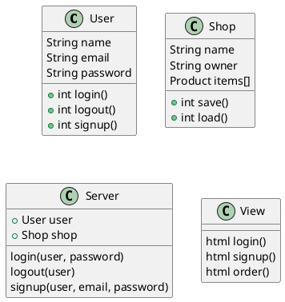

# iPos -- 類別圖

請寫出或繪出 iPos 的類別圖 (有幾個類別，分別有哪些函數)

# 物件導向分析 -- 類別

## 辨識《類別、方法、屬性》

根據上面的描述，用下列方法抽出《類別、方法、屬性》

1. 抽出描述中適當的《名詞》作為類別
2. 抽出描述中適當的《動詞》作為方法
3. 抽出描述中適當的《名詞或形容詞》作為屬性

## 用 PlantUML 繪製類別圖

```puml
@startuml
class User {
  String name
  String email
  String password

  +int login()
  +int logout()
  +int signup()
}

class Shop {
  String name
  String owner
  Product items[]

  +int save()
  +int load()
}

class Server {
  +User user
  +Shop shop

  {method} login(user, password)
  {method} logout(user)
  {method} signup(user, email, password)
}

class View {
  html login()
  html signup()
  html order()
}
@enduml
```
